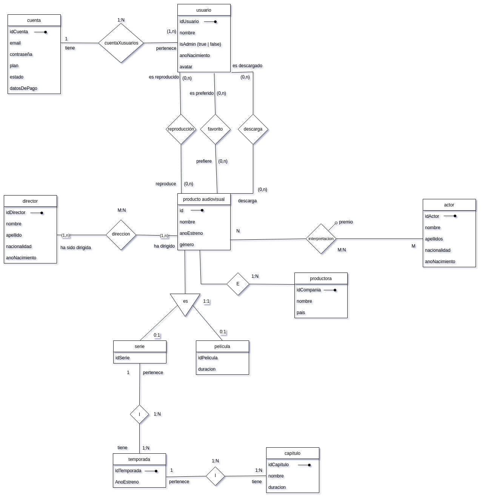

# 1. Clone de Netflix

Diseño de la base de datos de Piterflix. Una página web de estilo Netflix


# 2. Model conceptual
## 2.1. Enllaç públic a l'esquema
[Ver esquema](https://drive.google.com/file/d/1AW38a5pmmGrKcnVks5iyR_YrTLZUL3-o/view?usp=sharing)
## 2.2. Esquema conceptual (EC ó ER)
  
# 3. Model lògic relacional
## 3.1. Esquema lògic
  - producto_audiovisal(**idProductoAudiovisual**, titulo, tituloOriginal, idioma_original, id_api, anoEstreno, genero, <ins>idProductora</ins>)  
  - pelicula(**idPelicula**, duracion, descripcion<ins>idProducto_audiovisual</ins>)    
  - serie(**idSerie**, <ins>idProductoAudiovisual</ins>, descripcion)  
  - temporada(**nTemporada, <ins>idSerie</ins>**, anoEstreno)  
  - capitulo(**numeroCapitulo, <ins>idTemporada</ins>**, nombre, duracion, descripcion)    
  - actor(**idActor**, nombre, apellido, nacionalidad, anoNacimiento)   
  - interpretacion(<ins>**idProductoAudiovisual, idActor**</ins>)    
  - productora(**idProductora**, nombre, pais)   
  - director(**idDirector**, nombre, apellido, nacionalidad, anoNacimiento)  
  - direccion(<ins>**idDirector, idProductoAudiovisual**</ins>)  
  - cuenta(**idCuenta**, email, password, plan, estado, datosDePago)  
  - usuario(**idUsuario**, nombre, isAdmin, anoNacimiento, avatar, <ins>idCuenta</ins>)  
  - reproduccion(<ins>**idProductoAudiovisual,idUsuario**</ins>)  
  - favorito(<ins>**idProductoAudiovisual,idUsuario**</ins>)  
  - descarga(<ins>**idProductoAudiovisual,idUsuario**</ins>)  

## 3.2. Diagrama referencial

Relació referencial|Clau aliena|Relació referida
-|:-:|-
productoAudiovisual|idProductora|productora  
pelicula|idProductoAudiovisual|productoAudiovisual  
serie|idProductoAudiovisual|productoAudiovisual  
temporada|idSerie|serie  
capitulo|idTemporada|temporada  
interpretacion|idProductoAudiovisual|productoAudiovisual     
interpretacion|idActor|actor     
direccion|idProductoAudiovisual|productoAudiovisual
direccion|idDirector|director   
usuario|idCuenta|cuenta  
reproduccion|idProductoAudiovisual|productoAudiovisual      
reproduccion|idUsuario|usuario    
favorito|idProductoAudiovisual|productoAudiovisual  
favorito|idUsuario|usuario   
descarga|idProductoAudiovisual|productoAudiovisual  
descarga|idUsuario|usuario        

# 4. Model físic
## 4.1 SQL

  
```sql
 -- Crear la tabla de Producto_Audiovisual
CREATE TABLE Producto_Audiovisual (
id INT PRIMARY KEY,
titulo VARCHAR(255),
titulo_original VARCHAR(255),
idioma_original VARCHAR(255),
id_api INT,
anoEstreno INT,
genero VARCHAR(255),
id_productora INT,
FOREIGN KEY (id_productora) REFERENCES Productora(id)
);

-- Crear la tabla de Pelicula
CREATE TABLE Pelicula (
id INT PRIMARY KEY,
duracion INT,
id_producto_audiovisual INT,
FOREIGN KEY (id_producto_audiovisual) REFERENCES Producto_Audiovisual(id)
);

-- Crear la tabla de Serie
CREATE TABLE Serie (
id INT PRIMARY KEY,
id_producto_audiovisual INT,
FOREIGN KEY (id_producto_audiovisual) REFERENCES Producto_Audiovisual(id)
);

-- Crear la tabla de Temporada
CREATE TABLE Temporada (
id_serie INT,
numero_temporada INT,
PRIMARY KEY (id_serie, numero_temporada),
FOREIGN KEY (id_serie) REFERENCES Serie(id)
);

-- Crear la tabla de Capitulo
CREATE TABLE Capitulo (
id_temporada INT,
numero_capitulo INT,
nombre VARCHAR(255),
duracion INT,
PRIMARY KEY (id_temporada, numero_capitulo),
FOREIGN KEY (id_temporada) REFERENCES Temporada(id_serie, numero_temporada)
);

-- Crear la tabla de Actor
CREATE TABLE Actor (
id INT PRIMARY KEY,
nombre VARCHAR(255),
apellido VARCHAR(255),
anoNacimiento INT,
nacionalidad VARCHAR(255)
);

-- Crear la tabla de Interpretación
CREATE TABLE Interpretacion (
id_producto_audiovisual INT,
id_actor INT,
PRIMARY KEY (id_producto_audiovisual, id_actor),
FOREIGN KEY (id_producto_audiovisual) REFERENCES Producto_Audiovisual(id),
FOREIGN KEY (id_actor) REFERENCES Actor(id)
);

-- Crear la tabla de Productora
CREATE TABLE Productora (
id INT PRIMARY KEY,
nombre VARCHAR(255),
pais VARCHAR(255)
);

-- Crear la tabla de Director
CREATE TABLE Director (
id INT PRIMARY KEY,
nombre VARCHAR(255),
apellido VARCHAR(255),
anoNacimiento INT,
nacionalidad VARCHAR(255)
);

-- Crear la tabla de Dirección
CREATE TABLE Direccion (
id_director INT,
id_producto_audiovisual INT,
PRIMARY KEY (id_director, id_producto_audiovisual),
FOREIGN KEY (id_director) REFERENCES Director(id),
FOREIGN KEY (id_producto_audiovisual) REFERENCES Producto_Audiovisual(id)
);

-- Crear la tabla de Cuenta
CREATE TABLE Cuenta (
id INT PRIMARY KEY,
email VARCHAR(255),
passwd VARCHAR(255),
plan VARCHAR(255),
estado VARCHAR(255),
datos_de_pago VARCHAR(255)
);

-- Crear la tabla de Usuario
CREATE TABLE Usuario (
id INT PRIMARY KEY,
id_cuenta INT,
nombre VARCHAR(255),
anoNacimiento VARCHAR(255),
avatar VARCHAR(255),
isAdmin BOOLEAN,
FOREIGN KEY (id_cuenta) REFERENCES Cuenta(id)
);

-- Crear la tabla de Reproducción
CREATE TABLE Reproduccion (
id_producto_audiovisual INT,
id_usuario INT,
PRIMARY KEY (id_producto_audiovisual, id_usuario),
FOREIGN KEY (id_producto_audiovisual) REFERENCES Producto_Audiovisual(id),
FOREIGN KEY (id_usuario) REFERENCES Usuario(id)
);

-- Crear la tabla de Favorito
CREATE TABLE Favorito (
id_producto_audiovisual INT,
id_usuario INT,
PRIMARY KEY (id_producto_audiovisual, id_usuario),
FOREIGN KEY (id_producto_audiovisual) REFERENCES Producto_Audiovisual(id),
FOREIGN KEY (id_usuario) REFERENCES Usuario(id)
);

-- Crear la tabla de Descarga
CREATE TABLE Descarga (
id_producto_audiovisual INT,
id_usuario INT,
PRIMARY KEY (id_producto_audiovisual, id_usuario),
FOREIGN KEY (id_producto_audiovisual) REFERENCES Producto_Audiovisual(id),
FOREIGN KEY (id_usuario) REFERENCES Usuario(id)
);
```